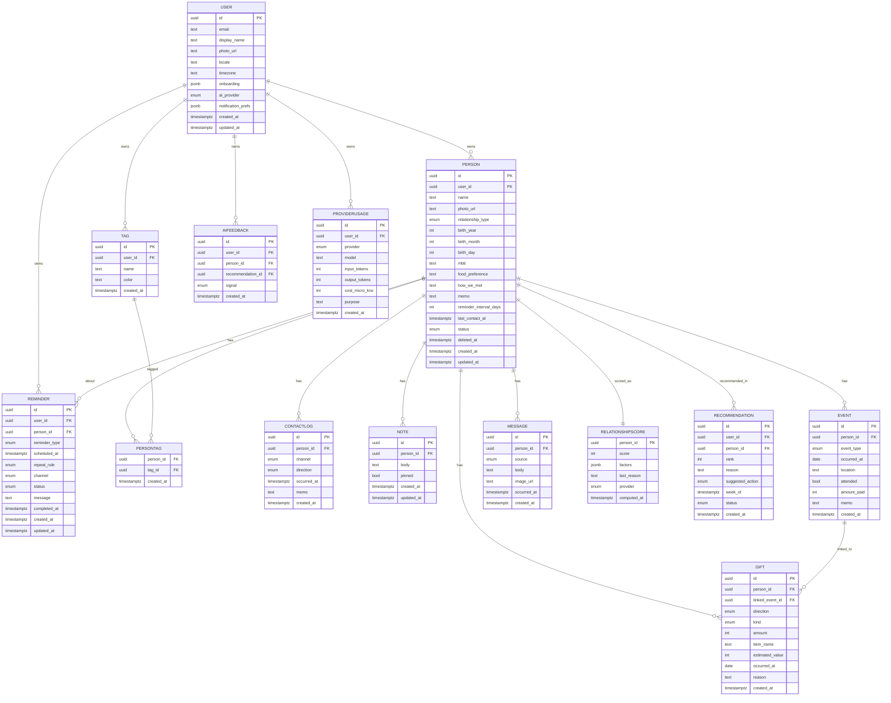

# 관계부 데이터 모델 (Domain Model & ERD)

> 작성자: Product Planner Agent
> 최종 갱신: 2026-05-04
> 버전: v0.1
> 대상: backend-engineer (Supabase 스키마), ai-engineer (LLM 컨텍스트 구성), frontend-engineer (타입스크립트 타입)

본 문서는 관계부의 도메인 모델을 정의한다. Supabase Postgres 기준이며, 모든 사용자 데이터는 RLS(Row Level Security)로 격리된다.

---

## 1. 엔티티 개요

| 엔티티 | 역할 | 마일스톤 |
|--------|------|---------|
| User | 가입한 사용자 (Supabase Auth 확장) | M1 |
| Person | 사용자가 관리하는 인물 | M1 |
| Tag | 사용자 정의 태그 | M1 |
| PersonTag | Person ↔ Tag 조인 (N:M) | M1 |
| ContactLog | 연락 1건 | M1 |
| Reminder | 다음 연락/이벤트 알림 | M1 |
| Note | 인물별 시간순 노트 | M1 |
| RelationshipScore | AI 산출 관계 건강도 | M1 |
| Recommendation | AI Top 5 추천 카드 | M1 |
| Event | 경조사 1건 | M2 |
| Gift | 선물 주고받음 1건 | M2 |
| Message | 메시지/캡처 저장 | M2 |
| AIFeedback | 추천 피드백 | M1 |
| ProviderUsage | LLM 토큰 사용 로그 | M1 |

---

## 2. ERD (Mermaid)



---

## 3. 엔티티 상세

### 3.1 User
Supabase Auth `auth.users`를 확장하는 `public.users` 프로필 테이블. 1:1 매핑.

| 필드 | 타입 | 제약 | 설명 |
|------|------|------|------|
| id | uuid | PK, FK→auth.users.id | |
| email | text | unique, not null | |
| display_name | text | 1~30 | |
| photo_url | text | nullable | |
| locale | text | 기본 'ko-KR' | |
| timezone | text | 기본 'Asia/Seoul' | IANA |
| onboarding | jsonb | | 사용 목적 칩, 완료 여부 등 |
| ai_provider | enum | 'claude' \| 'gemini' \| 'auto' | 기본 'auto' |
| notification_prefs | jsonb | | { reminders: bool, ai: bool, events: bool, quiet_hours: {start, end} } |
| created_at | timestamptz | default now() | |
| updated_at | timestamptz | trigger | |

관계: 1:N → Person, Tag, Reminder, AIFeedback, ProviderUsage

---

### 3.2 Person
사용자가 관리하는 인물.

| 필드 | 타입 | 제약 | 설명 |
|------|------|------|------|
| id | uuid | PK | |
| user_id | uuid | FK→users.id, not null | |
| name | text | 1~50, not null | |
| photo_url | text | | Storage 경로 |
| relationship_type | enum | family/friend/colleague/client/acquaintance/etc | 기본 'etc' |
| birth_year | int | 1900~현재, nullable | |
| birth_month | int | 1~12, nullable | |
| birth_day | int | 1~31, nullable | |
| mbti | text(4) | enum 16종 또는 null | |
| food_preference | text | 0~200 | |
| how_we_met | text | 0~100 | |
| memo | text | 0~2000 | |
| reminder_interval_days | int | 0~365, 기본 관계유형별 | |
| last_contact_at | timestamptz | nullable | ContactLog 트리거로 갱신 |
| status | enum | active/inactive | 기본 active |
| deleted_at | timestamptz | nullable | soft-delete |
| created_at | timestamptz | default now() | |
| updated_at | timestamptz | trigger | |

인덱스:
- `(user_id)` btree
- `(user_id, last_contact_at desc)` 부분 인덱스 (status='active')
- `(user_id, name) tsvector` 검색용
- `(user_id, deleted_at)`

관계: N:1 ← User / 1:N → ContactLog, Note, Event, Gift, Message, Reminder, Recommendation / N:M ↔ Tag (PersonTag)

제약:
- 사용자별 활성 인물 1,000명 제한 (M1)
- name 빈 문자열 금지 (CHECK)

---

### 3.3 Tag
사용자 정의 라벨.

| 필드 | 타입 | 제약 | 설명 |
|------|------|------|------|
| id | uuid | PK | |
| user_id | uuid | FK→users.id | |
| name | text | 1~20, unique(user_id, name) | |
| color | text(7) | hex 또는 null (자동 배정) | |
| created_at | timestamptz | default now() | |

인덱스: `(user_id, name)` unique

관계: N:1 ← User / N:M ↔ Person

---

### 3.4 PersonTag (조인 테이블)
| 필드 | 타입 | 제약 |
|------|------|------|
| person_id | uuid | FK→Person, on delete cascade |
| tag_id | uuid | FK→Tag, on delete cascade |
| created_at | timestamptz | default now() |

PK: (person_id, tag_id)
인덱스: `(tag_id)` (역방향 조회)

---

### 3.5 ContactLog
연락 1건 기록.

| 필드 | 타입 | 제약 |
|------|------|------|
| id | uuid | PK |
| person_id | uuid | FK→Person, on delete cascade |
| channel | enum | phone/kakao/sms/email/inperson/other |
| direction | enum | outbound/inbound/unknown, 기본 'unknown' |
| occurred_at | timestamptz | not null |
| memo | text | 0~500 |
| created_at | timestamptz | default now() |

인덱스: `(person_id, occurred_at desc)`
트리거: 삽입/수정/삭제 시 Person.last_contact_at 재계산 (max(occurred_at))

---

### 3.6 Reminder
| 필드 | 타입 | 제약 |
|------|------|------|
| id | uuid | PK |
| user_id | uuid | FK→User |
| person_id | uuid | FK→Person, on delete cascade |
| reminder_type | enum | followup/birthday/event/custom |
| scheduled_at | timestamptz | not null |
| repeat_rule | enum | none/yearly, 기본 'none' |
| channel | enum | inapp/webpush/kakao(P2) |
| status | enum | active/done/dismissed/snoozed, 기본 'active' |
| message | text | 0~200, nullable (null이면 자동 생성) |
| completed_at | timestamptz | nullable |
| created_at | timestamptz | default now() |
| updated_at | timestamptz | trigger |

인덱스:
- `(user_id, scheduled_at)` 발송 cron 조회
- `(person_id, status)` 활성 followup 1개 제약용

부분 unique: `(person_id) WHERE reminder_type='followup' AND status='active'` → 인물당 활성 followup 1개

---

### 3.7 Note
| 필드 | 타입 | 제약 |
|------|------|------|
| id | uuid | PK |
| person_id | uuid | FK→Person, on delete cascade |
| body | text | 1~5000 |
| pinned | bool | 기본 false |
| created_at | timestamptz | default now() |
| updated_at | timestamptz | trigger |

인덱스: `(person_id, pinned desc, created_at desc)`
제약: 인물당 pinned=true 최대 3개 (애플리케이션 레벨)

---

### 3.8 Event (M2)
| 필드 | 타입 | 제약 |
|------|------|------|
| id | uuid | PK |
| person_id | uuid | FK→Person, on delete cascade |
| event_type | enum | wedding/funeral/firstbirthday/birthday/anniversary/other |
| occurred_at | date | not null |
| location | text | 0~100 |
| attended | bool | nullable |
| amount_paid | int | KRW, ≥ 0, nullable |
| memo | text | 0~500 |
| created_at | timestamptz | default now() |

인덱스: `(person_id, occurred_at desc)`

---

### 3.9 Gift (M2)
| 필드 | 타입 | 제약 |
|------|------|------|
| id | uuid | PK |
| person_id | uuid | FK→Person, on delete cascade |
| linked_event_id | uuid | FK→Event, nullable, on delete set null |
| direction | enum | sent/received |
| kind | enum | cash/item |
| amount | int | KRW, kind='cash'일 때 not null |
| item_name | text | 1~50, kind='item'일 때 not null |
| estimated_value | int | KRW, kind='item' 시 nullable |
| occurred_at | date | not null |
| reason | text | 0~100 |
| created_at | timestamptz | default now() |

CHECK 제약:
- kind='cash' AND amount IS NOT NULL AND item_name IS NULL
- kind='item' AND item_name IS NOT NULL

인덱스: `(person_id, direction, occurred_at desc)`

---

### 3.10 Message (M2)
| 필드 | 타입 | 제약 |
|------|------|------|
| id | uuid | PK |
| person_id | uuid | FK→Person, on delete cascade |
| source | enum | kakao/sms/email/other |
| body | text | 0~10000 |
| image_url | text | nullable, Storage 경로 |
| occurred_at | timestamptz | not null |
| created_at | timestamptz | default now() |

인덱스: `(person_id, occurred_at desc)`

---

### 3.11 RelationshipScore
인물별 1:1 (현재 점수만 보관, 이력은 별도 테이블 P1).

| 필드 | 타입 | 제약 |
|------|------|------|
| person_id | uuid | PK, FK→Person, on delete cascade |
| score | int | 0~100, not null |
| factors | jsonb | { recency, balance, frequency, feedback } 가중 |
| last_reason | text | AI 추천 사유 캐시 |
| provider | enum | claude/gemini/rule_based |
| computed_at | timestamptz | not null |

이력 테이블 (P1): RelationshipScoreHistory(person_id, score, computed_at)

---

### 3.12 Recommendation
주간 Top 5 추천 카드.

| 필드 | 타입 | 제약 |
|------|------|------|
| id | uuid | PK |
| user_id | uuid | FK→User |
| person_id | uuid | FK→Person, on delete cascade |
| rank | int | 1~5 |
| reason | text | AI 생성 한국어 1~2문장 |
| suggested_action | enum | call/kakao/event_attend/etc |
| week_of | date | 그 주 월요일 (UTC) |
| status | enum | new/seen/accepted/dismissed |
| created_at | timestamptz | default now() |

인덱스: `(user_id, week_of desc)` / unique(user_id, person_id, week_of)

---

### 3.13 AIFeedback
| 필드 | 타입 | 제약 |
|------|------|------|
| id | uuid | PK |
| user_id | uuid | FK→User |
| person_id | uuid | FK→Person, nullable, on delete cascade |
| recommendation_id | uuid | FK→Recommendation, nullable |
| signal | enum | thumbs_up/thumbs_down/lower_priority/dismiss |
| created_at | timestamptz | default now() |

용도: 다음 분석 시 가중치 조정 컨텍스트.

---

### 3.14 ProviderUsage
LLM 호출 이력.

| 필드 | 타입 | 제약 |
|------|------|------|
| id | uuid | PK |
| user_id | uuid | FK→User |
| provider | enum | claude/gemini |
| model | text | 'claude-sonnet-4', 'gemini-2.5-flash' 등 |
| input_tokens | int | ≥ 0 |
| output_tokens | int | ≥ 0 |
| cost_micro_krw | int | 1/1,000,000 KRW 단위, 정수 보관 |
| purpose | text | 'weekly_analysis' / 'manual_trigger' / 'message_draft' |
| created_at | timestamptz | default now() |

인덱스: `(user_id, created_at desc)` 월별 quota 집계용

---

## 4. Enum 정의

```sql
-- 관계 유형
CREATE TYPE relationship_type AS ENUM
  ('family','friend','colleague','client','acquaintance','etc');

-- 인물 상태
CREATE TYPE person_status AS ENUM ('active','inactive');

-- 연락 채널
CREATE TYPE contact_channel AS ENUM
  ('phone','kakao','sms','email','inperson','other');

-- 연락 방향
CREATE TYPE contact_direction AS ENUM ('outbound','inbound','unknown');

-- 리마인더 타입/반복/채널/상태
CREATE TYPE reminder_type AS ENUM ('followup','birthday','event','custom');
CREATE TYPE reminder_repeat AS ENUM ('none','yearly');
CREATE TYPE reminder_channel AS ENUM ('inapp','webpush','kakao');
CREATE TYPE reminder_status AS ENUM ('active','done','dismissed','snoozed');

-- 경조사
CREATE TYPE event_type AS ENUM
  ('wedding','funeral','firstbirthday','birthday','anniversary','other');

-- 선물
CREATE TYPE gift_direction AS ENUM ('sent','received');
CREATE TYPE gift_kind AS ENUM ('cash','item');

-- 메시지 출처
CREATE TYPE message_source AS ENUM ('kakao','sms','email','other');

-- AI
CREATE TYPE ai_provider AS ENUM ('claude','gemini','auto','rule_based');
CREATE TYPE recommendation_status AS ENUM ('new','seen','accepted','dismissed');
CREATE TYPE ai_feedback_signal AS ENUM
  ('thumbs_up','thumbs_down','lower_priority','dismiss');
```

---

## 5. RLS 정책 (Supabase)

원칙: 모든 테이블은 `user_id`(직접 또는 Person을 통한 간접) 기준으로 본인만 접근.

```sql
-- 예: PERSON
ALTER TABLE person ENABLE ROW LEVEL SECURITY;

CREATE POLICY person_owner_select ON person
  FOR SELECT USING (user_id = auth.uid());
CREATE POLICY person_owner_modify ON person
  FOR ALL USING (user_id = auth.uid())
  WITH CHECK (user_id = auth.uid());

-- 예: CONTACTLOG (Person을 통한 간접 소유)
ALTER TABLE contact_log ENABLE ROW LEVEL SECURITY;

CREATE POLICY contactlog_owner_all ON contact_log
  FOR ALL USING (
    EXISTS (
      SELECT 1 FROM person p
      WHERE p.id = contact_log.person_id AND p.user_id = auth.uid()
    )
  );
```

동일 패턴: Note, Event, Gift, Message, RelationshipScore (Person 경유) / Tag, Reminder, Recommendation, AIFeedback, ProviderUsage (직접 user_id).

---

## 6. 트리거 / 함수

### 6.1 last_contact_at 자동 갱신
```sql
CREATE OR REPLACE FUNCTION update_person_last_contact()
RETURNS trigger AS $$
BEGIN
  UPDATE person SET last_contact_at = (
    SELECT MAX(occurred_at) FROM contact_log WHERE person_id = NEW.person_id
  ),
  updated_at = now()
  WHERE id = NEW.person_id;
  RETURN NEW;
END;
$$ LANGUAGE plpgsql;

CREATE TRIGGER trg_contactlog_update_last
AFTER INSERT OR UPDATE OR DELETE ON contact_log
FOR EACH ROW EXECUTE FUNCTION update_person_last_contact();
```

### 6.2 updated_at 자동 갱신
모든 `updated_at` 컬럼에 표준 트리거.

### 6.3 Soft-delete 30일 후 hard-delete
일일 cron (Supabase Scheduled Function) — `deleted_at < now() - interval '30 days'`인 Person hard-delete.

---

## 7. 도메인 규칙 요약

| 규칙 | 위치 |
|------|------|
| 한 인물당 활성 followup 리마인더 1개 | DB 부분 unique 인덱스 |
| 사용자당 활성 인물 1,000명 | 애플리케이션 + DB 카운트 |
| pinned Note 최대 3개 | 애플리케이션 |
| Tag 이름 사용자별 unique | DB unique 제약 |
| 인물 삭제 = soft-delete + 30일 보존 | 트리거 + cron |
| LLM 토큰 quota 사용자별 월 한도 | 애플리케이션 (ProviderUsage 합계) |
| Person.last_contact_at = MAX(ContactLog.occurred_at) | 트리거 자동 |
| RelationshipScore 갱신은 주 1회 또는 수동 | 백그라운드 잡 |

---

## 8. TypeScript 타입 (frontend 참고용)

```ts
export type RelationshipType =
  | 'family' | 'friend' | 'colleague' | 'client' | 'acquaintance' | 'etc';

export interface Person {
  id: string;
  userId: string;
  name: string;
  photoUrl: string | null;
  relationshipType: RelationshipType;
  birthYear: number | null;
  birthMonth: number | null;
  birthDay: number | null;
  mbti: string | null;
  foodPreference: string | null;
  howWeMet: string | null;
  memo: string | null;
  reminderIntervalDays: number;
  lastContactAt: string | null; // ISO
  status: 'active' | 'inactive';
  deletedAt: string | null;
  createdAt: string;
  updatedAt: string;
  tags?: Tag[]; // joined
  relationshipScore?: number;
}
```
(나머지 엔티티도 동일 패턴으로 frontend-engineer가 생성)

---

## 9. 마일스톤별 스키마 도입 순서

| 마일스톤 | 도입 테이블 |
|---------|------------|
| M1 | User, Person, Tag, PersonTag, ContactLog, Reminder, Note, RelationshipScore, Recommendation, AIFeedback, ProviderUsage |
| M2 | Event, Gift, Message, RelationshipScoreHistory(P1) |
| M3 | ExternalIntegration(연락처/캘린더/카카오 토큰), Subscription(결제) |

---

## 10. 열린 이슈

- 다중 디바이스 push 토큰 관리 테이블 별도 필요 (UserPushSubscription) — M1 추가 권장
- 가족 공유 모드 (가족 간 인물 공유)는 보류 — M3+
- 검색 인덱싱 한국어 형태소(es: mecab) 도입 여부 — backend-engineer와 협의
- 멀티 테넌트 / 워크스페이스 모델은 비목표 (개인 앱)
