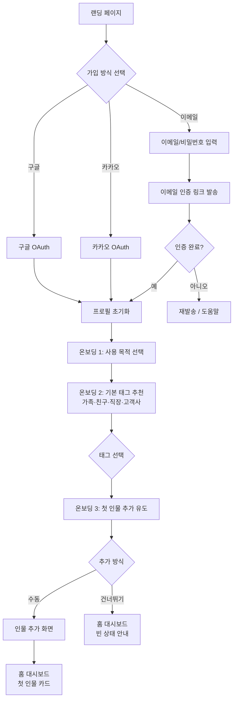
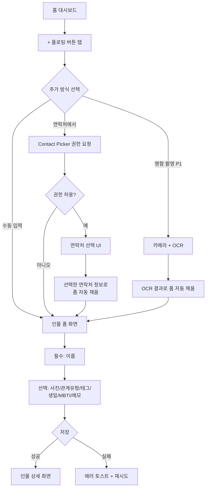
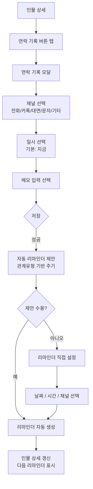
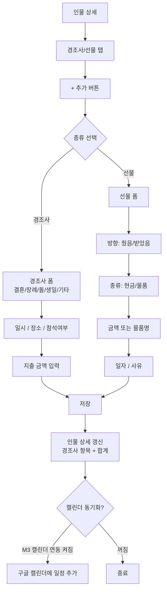
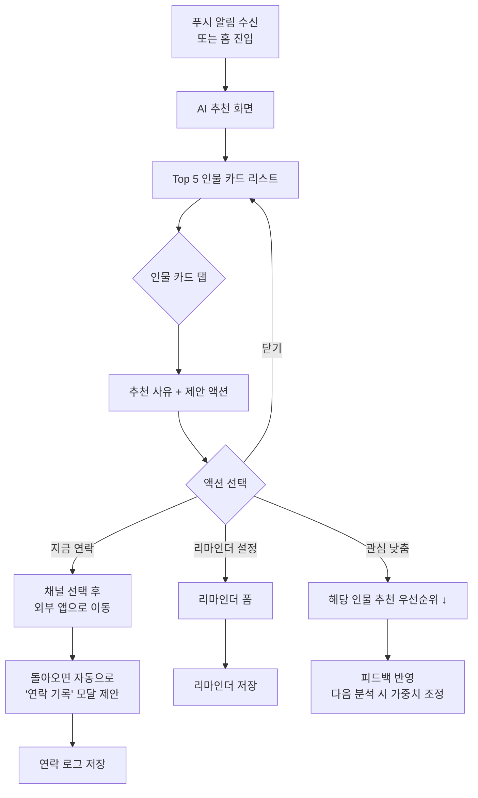
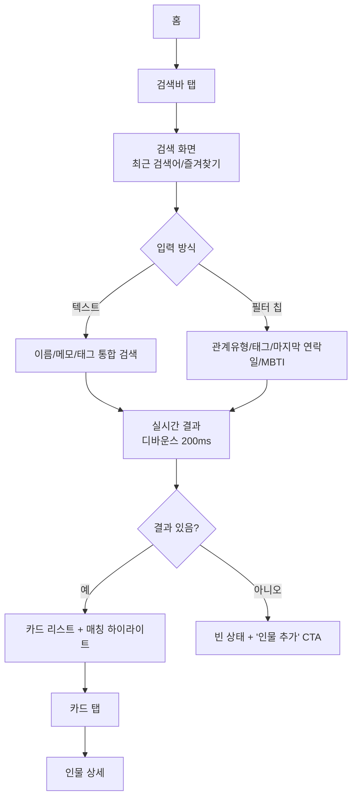
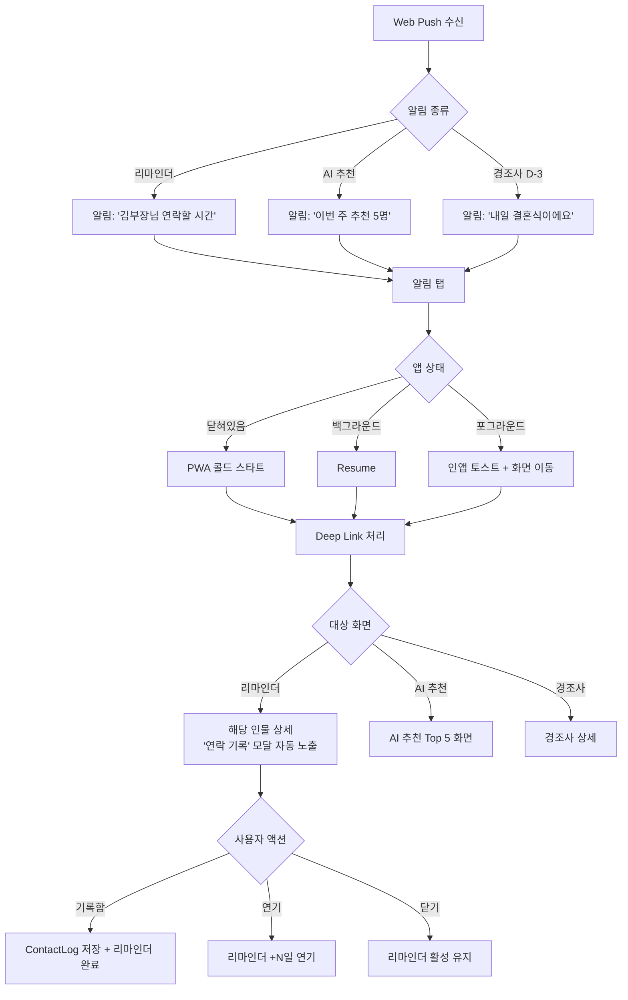

# 관계부 유저플로우 (User Flow)

> 작성자: Product Planner Agent
> 최종 갱신: 2026-05-04
> 버전: v0.1

본 문서는 관계부 앱의 7개 핵심 시나리오에 대한 사용자 흐름을 정의한다. 각 시나리오는 Mermaid 다이어그램, 단계별 상세, 엣지 케이스를 포함한다.

---

## 시나리오 1: 신규 가입 + 온보딩

**전제**: 비로그인 상태의 첫 방문자
**목표**: 가입 → 첫 인물 등록까지 5분 이내 완료
**진입점**: 랜딩 페이지 또는 PWA 첫 실행
**종료점**: 홈 대시보드에 첫 인물 카드 표시

### 플로우

### 단계 상세
1. **랜딩 페이지** — 보는 것: 한 줄 가치 제안 + CTA "지금 시작하기". 액션: 가입 버튼 탭.
2. **가입 방식 선택** — 보는 것: 구글/카카오/이메일 3개 버튼. (M1에서는 구글+이메일만, 카카오는 M2)
3. **OAuth/이메일 가입** — 액션: 권한 동의 또는 이메일·비밀번호 입력. 약관/개인정보 동의 체크.
4. **프로필 초기화** — 시스템: 사용자 표시명/프로필 사진(선택)을 OAuth에서 자동 채움. 사용자가 수정 가능.
5. **온보딩 1 — 사용 목적** — 칩 선택(복수): "영업/네트워킹", "친구·가족 챙김", "경조사 정리", "AI 추천 받기". → AI 분석 톤·추천 빈도 초기값에 반영.
6. **온보딩 2 — 기본 태그** — 시스템이 4개 기본 태그 제안. 사용자는 추가/제거 가능.
7. **온보딩 3 — 첫 인물 추가** — CTA: "지금 한 명 추가하기" / "나중에". 첫 인물 등록 시 마이크로 보상(축하 토스트 + 도움말).
8. **홈 대시보드** — 빈 상태: 일러스트 + "첫 인물을 추가해보세요". 인물 있을 시: 카드 리스트 + 상단 검색바 + 하단 [+] 플로팅 버튼.

### 엣지 케이스
- **OAuth 거부/취소** → 가입 방식 선택 화면으로 복귀, 토스트 "가입이 취소되었습니다"
- **이메일 인증 미완료(24시간)** → 재발송 가능, 7일 경과 시 임시 계정 삭제
- **이미 가입된 이메일** → "이미 가입된 계정입니다. 로그인하시겠습니까?" 다이얼로그
- **약관 미동의** → CTA 비활성, 인라인 에러
- **온보딩 도중 이탈** → 다음 진입 시 마지막 단계부터 재개

### 한국어 카피 예시
- 헤드라인: "잊지 않게, 흐지부지되지 않게."
- CTA: "지금 시작하기"
- 빈 상태: "아직 등록된 인물이 없어요. 첫 사람을 추가해볼까요?"

---

## 시나리오 2: 인물 추가 (수동 / 연락처 가져오기)

**전제**: 로그인 상태, 홈 대시보드
**목표**: 새 인물을 60초 이내 등록
**진입점**: 홈 [+] 플로팅 버튼 또는 온보딩 마지막 단계
**종료점**: 인물 상세 화면 또는 홈 카드 리스트에 신규 카드 표시

### 플로우

### 단계 상세
1. **+ 플로팅 버튼** — 위치: 홈 우측 하단. 탭 시 바텀시트로 추가 방식 노출.
2. **추가 방식 선택** — 옵션: "직접 입력" / "연락처에서 가져오기" / "명함 스캔(P1, M2 이후)".
3. **연락처에서 가져오기 (M2)** — Web Contacts Picker API 사용. iOS 미지원 시 옵션 숨김.
4. **인물 폼 화면** — 필드:
   - 이름 (필수, 1~50자)
   - 프로필 사진 (선택, 5MB 이하)
   - 관계유형 (드롭다운: 가족/친구/직장/고객사/지인/기타, M1에서는 단일 선택)
   - 태그 (멀티 선택 + 신규 생성)
   - 생일 (월·일만, 연도 선택)
   - 알게 된 경로 (자유 텍스트)
   - MBTI / 음식 취향 / 메모 (자유 텍스트)
   - 다음 연락 리마인더 주기 (없음/2주/1개월/3개월/6개월/직접입력)
5. **저장** — 시스템: Optimistic UI로 즉시 카드 표시, 백그라운드 동기화.
6. **인물 상세** — 보는 것: 프로필 헤더, 연락 로그 빈 상태, 메모 섹션, 액션 버튼(연락 기록/리마인더 설정/삭제).

### 엣지 케이스
- **이름 중복** → 경고 다이얼로그 "동명이인 OOO이 이미 있어요. 그래도 추가할까요?"
- **사진 업로드 실패** → 텍스트만 저장, 사진은 재시도 큐
- **오프라인** → IndexedDB에 임시 저장, 온라인 복구 시 자동 동기화
- **연락처 권한 거부** → 인앱 안내 후 수동 입력으로 폴백
- **OCR 인식 실패** → 사용자가 수동 보정

### 한국어 카피
- 헤더: "새 인물 추가"
- 필드 안내: "이름만 있으면 충분해요. 나중에 채워도 OK!"
- 저장 버튼: "저장하기"

---

## 시나리오 3: 연락 기록 + 리마인더 설정

**전제**: 로그인, 인물 1명 이상 존재
**목표**: 연락 1건 기록 + 다음 리마인더 자동/수동 설정
**진입점**: 홈 카드 / 인물 상세 / AI 추천 카드 / 알림 탭
**종료점**: 인물 상세에 연락 로그 추가 + 리마인더 일정 표시

### 플로우

### 단계 상세
1. **연락 기록 버튼** — 인물 상세 상단 우측. 빠른 액션 "방금 연락함" 칩도 제공.
2. **연락 기록 모달** — 풀스크린 모달, 필드:
   - 채널 (필수): 전화 / 카톡 / 대면 / 문자 / 이메일 / 기타
   - 일시 (필수, 기본: 현재 시각)
   - 발/수신 방향 (선택): 내가 먼저 / 상대가 먼저
   - 메모 (선택, 0~500자)
3. **저장** — 시스템: ContactLog 레코드 생성 + Person.last_contact_at 업데이트.
4. **리마인더 자동 제안** — 규칙:
   - 가족: 14일 후 / 친구: 30일 후 / 직장: 14일 후 / 고객사: 30일 후 / 지인: 60일 후
   - 이미 활성 리마인더 있으면 갱신 여부 확인
5. **리마인더 직접 설정** — 날짜/시간 + 알림 채널(인앱/Web Push). M3에서 카카오 알림톡 추가.
6. **저장 완료** — 토스트: "기록되었어요. 다음 리마인더는 6월 5일이에요."

### 엣지 케이스
- **미래 일시 입력** → 경고 "미래 시점인데 기록할까요? 보통 과거 연락을 기록해요."
- **연속 중복 입력 (5분 내 동일 채널)** → 합칠지 묻기
- **리마인더 충돌 (같은 인물 다중)** → 가장 최근 것으로 통합
- **Web Push 권한 거부** → 인앱 알림만 동작, 설정 화면에서 재요청 안내
- **오프라인 저장** → 큐에 보관, 온라인 시 동기화

### 한국어 카피
- 빠른 액션: "방금 연락함"
- 자동 제안: "친구 관계니까 한 달 뒤에 다시 연락 어때요?"
- 토스트: "연락 기록 완료! 다음은 {날짜}에 알려드릴게요."

---

## 시나리오 4: 경조사 / 선물 기록 (M2)

**전제**: 로그인, 인물 1명 이상, M2 이후
**목표**: 경조사 1건 + 선물(현금/물품) 5초 이내 기록
**진입점**: 인물 상세 / 빠른 추가 / 캘린더 알림
**종료점**: 인물 상세 경조사 탭에 항목 추가, 합계 갱신

### 플로우

### 단계 상세
1. **경조사/선물 탭** — 인물 상세에 탭 추가. 카드 리스트 + 누적 합계(받은 금액 / 준 금액).
2. **+ 추가** — 바텀시트로 종류 선택.
3. **경조사 폼** — 필드:
   - 종류 (필수): 결혼·장례·돌·생일·기념일·기타
   - 일시 (필수)
   - 장소 (선택)
   - 참석 여부 (참석/불참)
   - 지출 금액 (선택, 0원 가능)
   - 메모
4. **선물 폼** — 필드:
   - 방향 (필수): 줬음 / 받았음
   - 종류: 현금 / 물품
   - 금액 (현금 시) 또는 물품명·예상가 (물품 시)
   - 일자, 사유 (생일·감사·답례 등)
5. **합계 갱신** — 인물 상세 헤더에 "받음 ₩XXX,XXX / 줌 ₩YYY,YYY" 표시.

### 엣지 케이스
- **금액 단위 혼동** → 입력 시 천단위 콤마 자동 표시
- **참석 못한 경조사 + 지출 0원** → 메모로 "마음만 보냄" 같은 자유 표기 허용
- **다년간 누적 합계** → 인물 상세 합계 외 연도별 그래프(P1 이후)
- **삭제 시** → "이 항목을 삭제하면 합계에서 제외됩니다" 확인

### 한국어 카피
- 종류 라벨: "어떤 일이에요?" 결혼/장례/돌/생일/기념일/기타
- 합계 카드: "이번 해 OOO님과 ₩XXX,XXX 주고받았어요"

---

## 시나리오 5: AI 관계 분석 결과 확인 + 액션 추천 수락

**전제**: 로그인, 인물 5명 이상, 연락 로그 누적
**목표**: 주 1회(또는 트리거) AI 추천 Top 5 확인 → 1건 이상 액션 수락
**진입점**: 푸시 알림 "이번 주 추천 인물 도착" / 홈 상단 카드
**종료점**: 추천 인물에 연락 또는 리마인더 설정

### 플로우

### 단계 상세
1. **푸시 알림** — 텍스트 "이번 주 연락 추천 5명을 준비했어요". 탭 시 AI 추천 화면.
2. **Top 5 카드 리스트** — 카드 정보:
   - 프로필 사진 + 이름 + 관계유형
   - 마지막 연락일 + 경과
   - 관계 건강도 점수 (0~100, 색상 표시)
   - 추천 사유 (1줄, AI 생성, 한국어)
3. **추천 사유 상세** — 예: "지난 3개월 연락이 없고, 작년 이맘때 결혼식에 와주셨어요. 한 번 안부 어때요?"
4. **제안 액션** — Primary: "지금 연락" / Secondary: "리마인더 설정" / Tertiary: "관심 낮춤".
5. **지금 연락** — 채널 선택 후 외부 앱(전화·카톡 등) 이동. 복귀 시 "연락 기록 모달" 자동 노출.
6. **관심 낮춤** — 사용자 피드백을 LLM 컨텍스트에 누적, 다음 추천에서 가중치 하향.
7. **분석 빈도** — 주 1회 자동(월요일 09:00 KST) + 사용자 수동 트리거 가능.

### 엣지 케이스
- **인물 5명 미만** → "조금만 더 등록하면 추천을 시작할게요" 안내, 분석 미실행
- **AI API 실패** → 폴백 프로바이더 시도 → 모두 실패 시 규칙 기반 추천(마지막 연락일 기준)
- **추천 사유가 어색/실수** → 카드 우측 상단 "이 추천 별로에요" 피드백 (다음 분석 가중치)
- **사용자가 매번 모든 추천 닫음** → 7일 후 빈도 1회 → 격주로 자동 조정 제안
- **민감 인물 (가족 사망 등)** → 메모에 "비활성" 플래그 시 추천 제외

### 한국어 카피
- 푸시: "이번 주 연락 추천 5명이 도착했어요"
- 추천 사유 톤: 부드럽고 강요하지 않게. "어때요?", "한 번 안부 전해볼까요?"
- 부정 피드백: "이 추천이 마음에 안 들어요"

---

## 시나리오 6: 검색 / 필터

**전제**: 로그인, 인물 10명 이상
**목표**: 원하는 인물을 1초 이내 찾기
**진입점**: 홈 상단 검색바 / 단축키
**종료점**: 인물 카드 결과 리스트 또는 인물 상세

### 플로우

### 단계 상세
1. **검색바** — 홈 상단 고정. 플레이스홀더 "이름·태그·MBTI로 검색".
2. **검색 화면** — 최근 검색어 5개 + 자주 쓰는 필터 추천.
3. **검색 대상** (M1):
   - 이름 (전체일치 + 부분일치 + 초성 검색)
   - 태그
   - 메모 (전문 검색)
   - MBTI
   - 관계유형
4. **필터** (M1):
   - 관계유형 (단일/멀티)
   - 태그 (멀티)
   - 마지막 연락일 범위 (안함 / 1주 내 / 1개월 내 / 3개월 이상 무연락)
   - 생일 다가옴 (이번 달 / 7일 내)
5. **결과 정렬** — 기본: 관련도 → 마지막 연락일 역순. 사용자 옵션: 이름 가나다, 추가일.
6. **매칭 하이라이트** — 검색어와 일치하는 부분 강조.

### 엣지 케이스
- **초성 검색** ("ㅎㄱㄷ" → "홍길동") 한국어 사용자 필수
- **결과 0건** → 빈 상태 + "혹시 다른 표현으로 검색해보세요" + 추가 CTA
- **필터 조합 결과 0건** → 어떤 필터를 풀면 결과가 나오는지 안내
- **대량 데이터 (500명+)** → 가상 스크롤, 페이지당 50건
- **오프라인** → IndexedDB 캐시에서 검색

### 한국어 카피
- 플레이스홀더: "이름·태그·MBTI로 검색"
- 빈 상태: "검색 결과가 없어요. 새 인물을 추가하시겠어요?"

---

## 시나리오 7: 알림 수신 → 앱 진입

**전제**: 로그인, 알림 권한 허용, 리마인더 또는 AI 추천 활성
**목표**: 알림 → 컨텍스트 화면(인물 상세 or AI 추천) 직진 → 액션 완료
**진입점**: Web Push (또는 시스템 알림 센터)
**종료점**: 연락 기록 또는 리마인더 처리 완료

### 플로우

### 단계 상세
1. **Web Push 수신** — Service Worker가 메시지 수신. 알림 페이로드: `{type, target_id, title, body}`.
2. **알림 표시** — OS 알림 센터에 표시. 액션 버튼: "기록함", "1일 연기" (가능한 OS만).
3. **알림 탭 → Deep Link** — `/p/{personId}?action=log` 또는 `/ai/recommendations` 같은 경로.
4. **콜드/리줌 처리** — Next.js App Router로 라우팅, 인증 만료 시 로그인 후 Deep Link 복원.
5. **자동 모달 노출** — 리마인더 알림 진입 시 "연락 기록" 모달 0.5초 후 자동 오픈(옵션 OFF 가능).
6. **연기 액션** — 1일/3일/1주 옵션. 리마인더 next_at 갱신.
7. **완료** — 리마인더 status = done, ContactLog 생성, 다음 자동 리마인더 제안.

### 엣지 케이스
- **알림 권한 거부** — 인앱 배너로만 동작, 설정에서 재요청 가능
- **iOS PWA 미설치** — Push 미지원 안내 + "홈 추가" 가이드
- **로그아웃 상태에서 알림 탭** — 로그인 후 원래 Deep Link로 복귀
- **알림 페이로드 손상** — 홈 대시보드로 폴백
- **다중 디바이스** — 한 디바이스에서 처리하면 다른 디바이스에서 dismiss
- **시간대 변경 (해외 출장)** — 사용자 timezone 기준 발송, 디바이스 시간과 차이 시 안내

### 한국어 카피
- 리마인더 알림 제목: "{이름}님께 연락할 시간이에요"
- 본문: "마지막 연락 {N}일 전. 한번 안부 어떠세요?"
- 액션 버튼: "기록함" / "내일로 연기"

---

## 공통 엣지 케이스 (전 시나리오)

| 케이스 | 처리 |
|--------|------|
| 네트워크 단절 | Optimistic UI + IndexedDB 큐 + 토스트 "오프라인이에요. 다시 연결되면 동기화돼요" |
| 인증 만료 | 자동 갱신 시도 → 실패 시 로그인 화면 + 원래 화면 복귀 |
| 로딩 지연 (3초+) | 스켈레톤 → 5초 시 "느려지고 있어요" 안내 |
| 다국어/타임존 | 한국어/KST 기본, 사용자 설정 가능 (M3) |
| 접근성 | ARIA 라벨, 최소 터치 타겟 44px, 색상 대비 WCAG AA |
| 다크 모드 | 시스템 설정 추종 + 수동 토글 |
